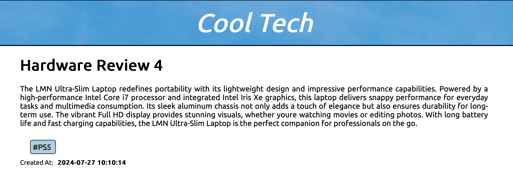
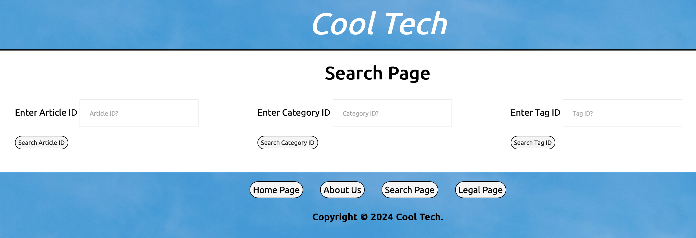

## Home Page


## Search page and other pages


# Table of Contents
1. [Introduction](#cool-tech-blog)
2. [Skillset](#skillset)
3. [Features](#features)
4. [Installation](#installation)
5. [Usage](#usage)
6. [Credits](#credits)

# Cool-Tech-Blog
Welcome to the Cool-Tech Blog repository, where we keep the dynamic 
website code for tech enthusiasts. Our blog specialises in digestible 
information about all things technology for popular consumption. 
It uses a seeder filer that connects to the database using mysql 
where it creates manual tags in the table so the user can view each 
article on the search page. 

In this project I created a dynamic website for a fictitious company called Cool Tech that includes the following features:

The website must distinguish between article categories, such as:
Hardware Reviews
Software Reviews
Opinion Pieces
Tech News
Articles are to be taggable (for improved Search Engine Optimization)

The app must include the following pages:
Home Page
Article View Page
Category View Page (only articles of a certain category are listed)
Tag View Page (only articles of a certain tag are listed)
"About Us" Page
Legal Page
Designing an appropriate database that stores articles, their categories, and their tags.

Check my [Cool Tech ERD](CoolTechERD.pdf) 
outlining my DB design.

## Skillset
This project requires an understanding of:

PHP (rendering web content on the backend)

Laravel (do the web app heavy lifting)

SQL Server (implement persistent data management)

## Installation

Clone the repository:

```bash
git clone https://github.com/M311HAN/Cool-Tech-Blog.git

# Navigate into the cloned directory:

cd Cool-Tech-Blog

```
## Usage

Berfore serving this site, run the following from the command-line from within main directory:

```bash
php artisan migrate:fresh --seed
```
After that has completed, run the following:
```bash
php artisan serve
```

Open up your favourite browser and navigate to http://localhost:8000.

## Features

Dynamic article pages with categories and tags.
Search functionality for articles by ID, category, and tag.

Cookie notice for compliance and transparency.
A comprehensive footer with quick links and copyright notice.

## Credits

This project was created by Melihhan (https://github.com/M311HAN) as well as the use of Laravel. For more details, questions, or feedback, reach out through GitHub.
